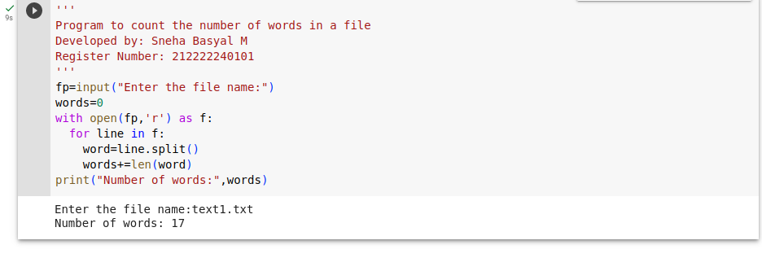
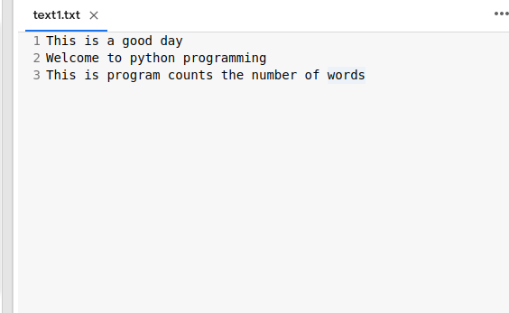

# Word-count
## AIM:
To write a python program for getting the word count from a text.
## EQUIPEMENT'S REQUIRED: 
PC
Anaconda - Python 3.7
## ALGORITHM: 
### Step 1:
Create a file object and get file name from the user

### Step 2: 
Open the file given by the user
 
### Step 3: 
Using for loop acess the file

### Step 4:  
Use split funtion to separate the words

### Step 5: 
The words is then counted by len function

### Step 6: 
Print the number of words

## PROGRAM:
```

'''
Program to count the number of words in a file
Developed by: Sneha Basyal M
Register Number: 212222240101
'''
fp=input("Enter the file name:")
words=0
with open(fp,'r') as f:
  for line in f:
    word=line.split()
    words+=len(word)
print("Number of words:",words)
```

### OUTPUT:





## RESULT:
Thus the program is written to find the word count from a text.
